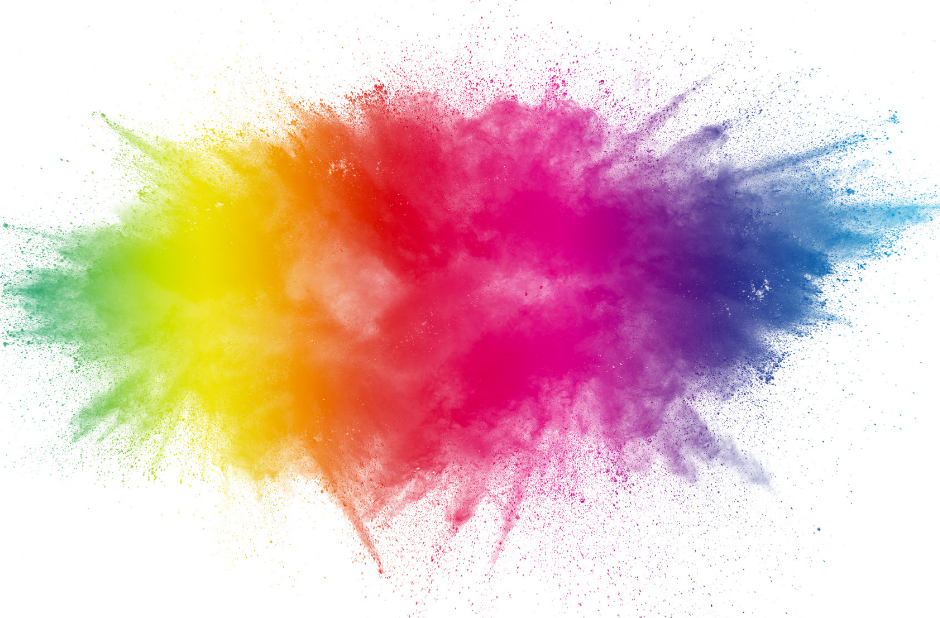
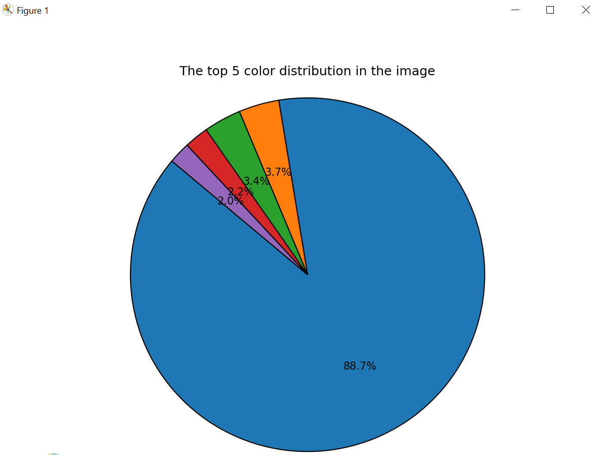

# Color_Analyzer

# פרויקט ניתוח צבעים בתמונה

פרויקט פייתון זה נועד לנתח תמונה דיגיטלית ולזהות את חמשת הצבעים הדומיננטיים ביותר בה. התוצאות מוצגות כגרף עוגה, כאשר כל תוית של צבע מוצגת בצבע התואם. בנוסף, מסופקת אנליזה טקסטואלית בסיסית של הצבעים הנפוצים ואחוזם בתמונה.

**במילים פשוטות:** הפרויקט מקבל תמונה, בודק אילו צבעים הכי נפוצים בה, ומציג את זה כעיגול צבעוני עם הסברים.

## שימוש

1.  ודא שקובץ התמונה שברצונך לנתח נמצא באותה תיקייה עם קובץ הפייתון (`Color_Analyzer.py`).
2.  הרץ את קובץ הפייתון.
3.  יוצג גרף עוגה עם חמשת הצבעים הנפוצים ביותר (התוויות שלהם יהיו צבועות בצבעים המתאימים), ובטרמינל תראה רשימה של הצבעים ואחוז השימוש שלהם בתמונה.

## דרישות

* Python 3
* Pillow
* matplotlib
* numpy

  
לדוגמא,
עבור תמונה זו:

הפלט היה :

